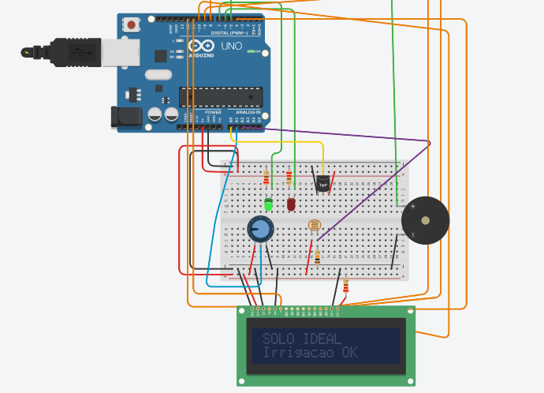
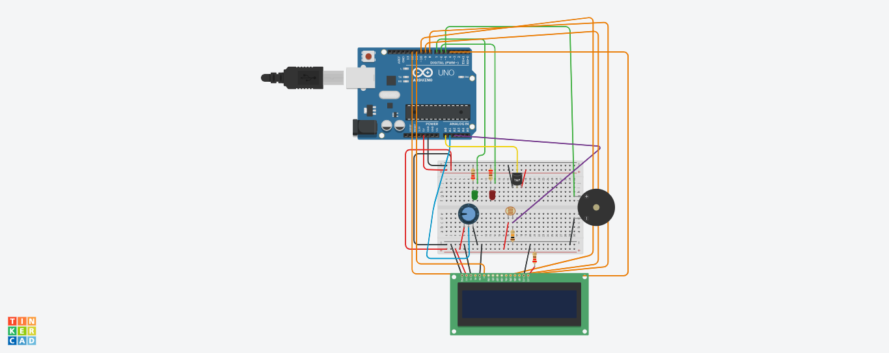

# 🌱 AgroVision Orbit

## 📌 Descrição do Projeto

O AgroVision Orbit é um sistema inteligente de monitoramento agrícola desenvolvido para auxiliar agricultores que não possuem acesso à agricultura de precisão.

A solução utiliza sensores locais conectados a um Arduino para monitorar condições ambientais da plantação, permitindo a identificação de possíveis riscos como seca, excesso de calor e baixa luminosidade.

Além disso, o sistema simula uma camada de monitoramento orbital (satélite), tornando a solução alinhada ao tema de Indústria Espacial proposto pela Global Solution da FIAP.

---

## 👥 Integrantes do Grupo

Alexandre Jardim de Souza RM: 573744
Fernando Eiji Tanaka RM: 570871
João Pedro Tavares Belon RM: 571392
Kauã Kanin Kagawa RM: 571461


---

## 🎯 Objetivo da Solução

O principal objetivo do projeto é oferecer uma alternativa acessível para agricultores que não possuem tecnologias avançadas de monitoramento agrícola.

O sistema busca:

- Reduzir desperdício de água;
- Melhorar a irrigação;
- Monitorar condições climáticas;
- Prevenir riscos de seca;
- Auxiliar na tomada de decisão do agricultor;
- Tornar a agricultura de precisão mais acessível.

---

## ⚙️ Componentes Utilizados

Os seguintes componentes foram utilizados no projeto:

| Componente | Função |
|------------|--------|
| Arduino Uno | Controle principal do sistema |
| LCD 16x2 | Exibição de informações |
| Sensor TMP36 | Medição da temperatura |
| Potenciômetro | Simulação da umidade do solo |
| LDR | Monitoramento da luminosidade |
| LED Verde | Indicação de solo saudável |
| LED Vermelho | Alerta de risco |
| Buzzer | Alerta sonoro |
| Resistores | Controle elétrico do circuito |
| Protoboard | Organização do circuito |

---

## 🔧 Explicação do Funcionamento

O sistema realiza leituras constantes dos sensores para analisar as condições ambientais da plantação.

### 🌡️ Temperatura
O sensor TMP36 monitora a temperatura do ambiente.

Quando a temperatura ultrapassa **38°C**, o sistema identifica risco agrícola e exibe um alerta no LCD.

Exemplo:

```text
ALTO CALOR
Risco Agric.
```

---

### 💧 Umidade do Solo
A umidade do solo é simulada através de um potenciômetro.

O sistema possui três níveis:

#### Solo seco (<30%)

```text
ALERTA SECA
Irrigar agora
```

- LED vermelho ligado;
- buzzer ativado.

#### Umidade média (30% a 60%)

```text
ATENCAO
Pouca umidade
```

#### Solo saudável (>60%)

```text
SOLO IDEAL
Irrigacao OK
```

- LED verde ligado.

---

### ☀️ Luminosidade
O sensor LDR monitora a iluminação do ambiente.

Quando há pouca luz:

```text
Pouca Luz
Verificar
```

Caso contrário:

```text
Luz OK
Plantacao
```

---

### 🛰️ Simulação de Monitoramento via Satélite

Como diferencial do projeto, foi implementada uma lógica inspirada em dados orbitais.

O alerta do satélite é ativado quando:

- Temperatura acima de **38°C**
- Umidade abaixo de **40%**

Nessa situação, o sistema entende que há risco de seca e exibe:

```text
SATELITE
Seca prevista
```

Essa funcionalidade representa como dados espaciais podem auxiliar agricultores na previsão de problemas antes que eles afetem diretamente a plantação.

---

## 🔌 Estrutura do Circuito

### Ligações Principais

#### LCD 16x2

| LCD | Arduino |
|------|----------|
| RS | 12 |
| E | 11 |
| DB4 | 10 |
| DB5 | 9 |
| DB6 | 8 |
| DB7 | 4 |

#### LEDs

| Componente | Pino |
|------------|------|
| LED Verde | 7 |
| LED Vermelho | 6 |

#### Buzzer

| Componente | Pino |
|------------|------|
| Buzzer | 5 |

#### Sensores

| Sensor | Pino |
|---------|------|
| TMP36 | A0 |
| Umidade (Potenciômetro) | A1 |
| LDR | A2 |

---

## ▶️ Instruções de Execução

1. Monte o circuito no Tinkercad conforme a estrutura apresentada.

2. Faça upload do arquivo `codigo_arduino.ino` no Arduino Uno.

3. Inicie a simulação no Tinkercad.

4. Teste os sensores:

### 🌡️ Temperatura
Altere a temperatura do sensor TMP36.

### 💧 Umidade
Gire o potenciômetro para simular diferentes níveis de umidade do solo.

### ☀️ Luminosidade
Ajuste a intensidade do sensor LDR.

### 🛰️ Alerta Satelital
O alerta será acionado automaticamente quando:

- temperatura > 38°C
- umidade < 40%

Representando risco de seca previsto por monitoramento orbital.

---

## 💻 Tecnologias Utilizadas

- Arduino IDE (C++)
- Tinkercad
- Arduino Uno
- Sensores analógicos
- Edge Computing

## 📷 Imagens do Projeto

### Circuito no Tinkercad




